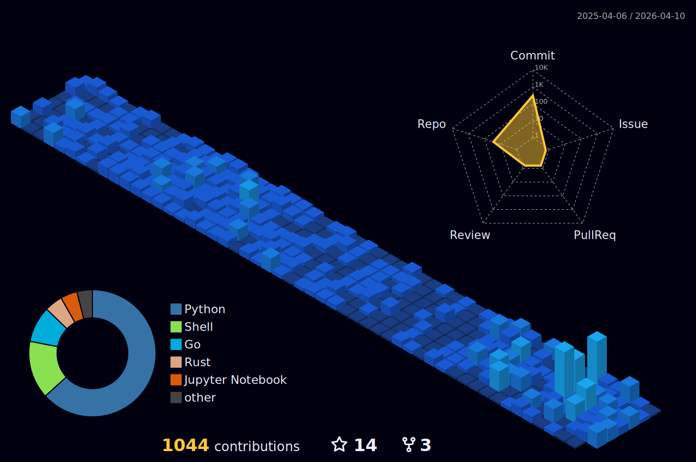

  
  

  🚀 💻 🌟 ⚡ 🔥

  

---

##  👤 About Me

> 💡 "Anybody can be a good programmer irrespective of whether they are introvert or extroverts. If fighting is sure to result in victory, than you must fight, even though the ruler forbid it!"

👋 I'm a passionate developer with a focus on **Python** 🐍 and **web technologies** 🌐. I love working on **data science** 📊 projects and creating useful applications that solve **real-world problems** 🌍.

### 💻 Technical Skills

---

## 🛠️ ⚡ Technologies

### 🕷️ Web Scraping

### 🧠 Machine Learning

### 🐳 DevOps & Infrastructure

### 💾 Databases

---

## 🎯 🧠 Programming Paradigms

---

## 📊 📈 GitHub Stats

&nbsp;

&nbsp;

  

---

## 🚀 🔭 Current Project

💰 **AI-powered investment decisions** 📊

---

## 🎨 🛠️ Current Projects

### 📈 Stock Advisor
🤖 AI-powered investment decision tool | 💰 Financial analytics

### 🕷️ Web Scraping
📊 Advanced scrapers for financial data extraction | 🔄 Real-time data

### 🧠 ML Models
🔮 Predictive models for various applications | 📉 Data analysis

---

## 📫 🤝 Connect With Me

---

  <b>Thanks for visiting! 👋</b>

  

